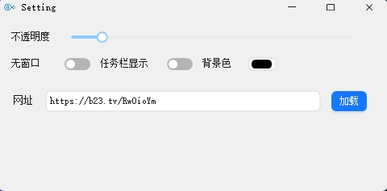

# TransBrowser
一款可以透明化的浏览网页应用

## 使用说明

1. 运行程序
2. 右键右下角图标设置
3. 输入要浏览的网页
4. 调整大小透明度

## 快捷键说明

| 快捷键 | 操作|
| --- | --- | 
|  Alt+D|  显示（隐藏）|  
|  Alt+F|  窗口置顶，置顶后窗口失去焦点不隐藏|  
|  Alt+Shift+Z|  后退|  
|  Alt+Shift+X|  前进|  

## 界面预览

